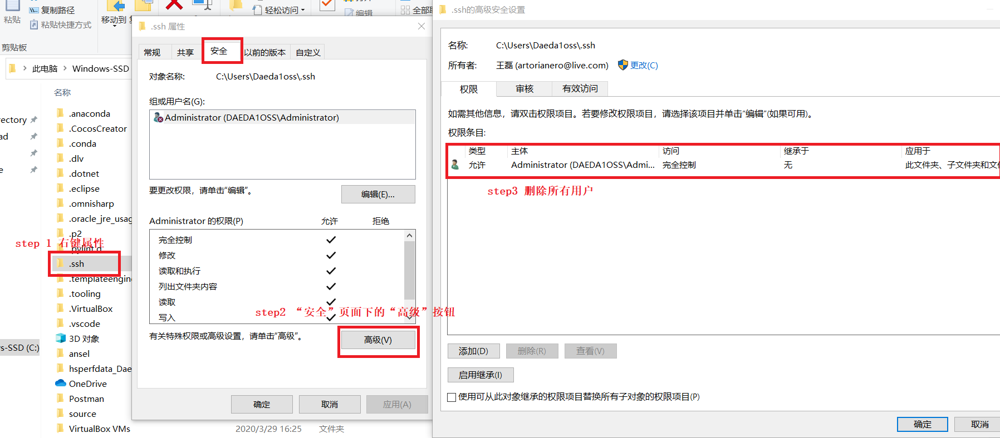
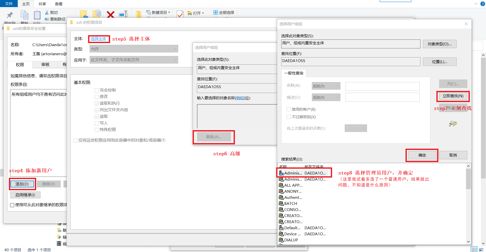
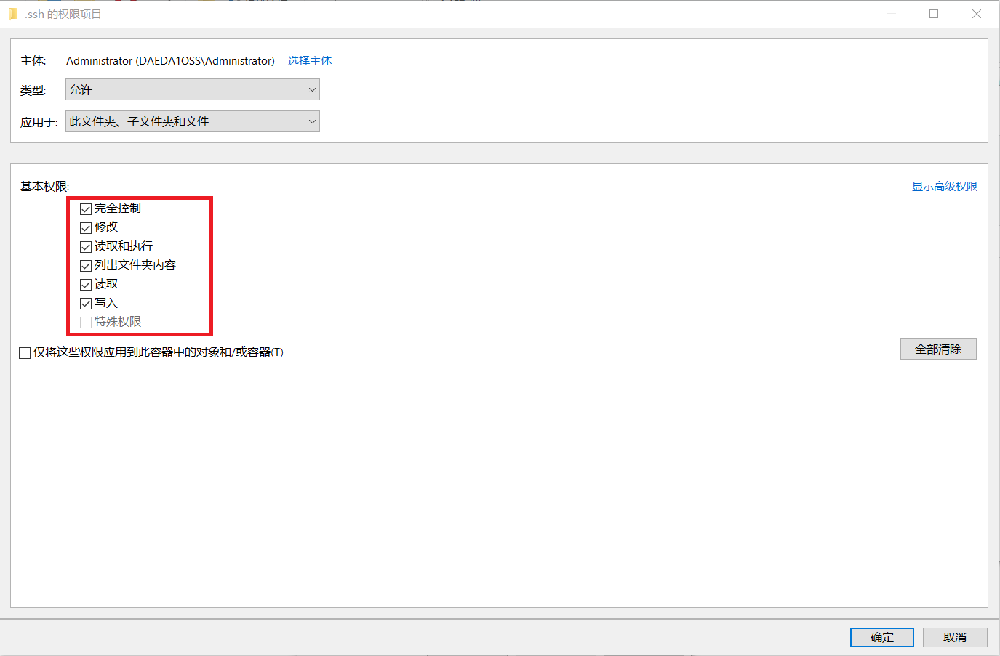
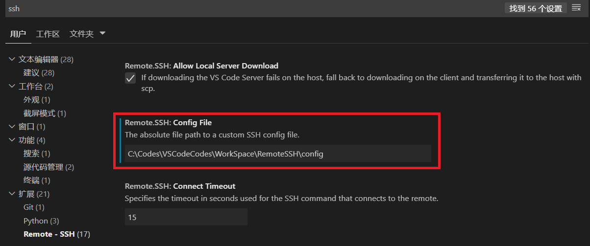
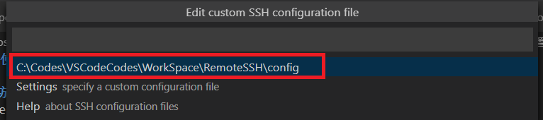

# **记录使用VS Code配置Remote SSH时遇到的一些问题的解决方法**

## **1.访问远程虚拟机出现Bad owner or permissions on C:\\\Users\\\xxxx/.ssh/config**

此时在powershell输入 ssh \<ip> -i \<username> -p \<port>同样也会出现该错误。

这里有个测试后发现有问题的方法

首先找到报错提示的.ssh目录，然后对该目录进行操作，如图所示：

选择完添加的用户后，一路确认就可以。在确认到图中所示地方时可以选择权限，这里我全勾上了，省的在使用Remote SSH时受到什么影响。

后续发现上面的方法存在问题，由于没有给普通用户赋予权限，会导致无法读取配置，但增加普通用户后又会报错。

经过测试找到了一个方法，先自建一个目录，并在VSCODE设置中将其配置SSH配置文件的路径，然后保存配置项时保存到该文件即可。

## **2.自动连接ssh配置**

    1.在Windows上打开powershell，执行ssh-keygen -t rsa -b 4096 -f "$HOME\.ssh\id_rsa-remote-ssh"，生成id_rsa-remote-ssh和id_rsa-remote-ssh.pub。

    2.在Linux对应用户的.ssh目录（如/home/scott/.ssh)下创建authorized_keys文件，将之前Windows下生成的id_rsa-remote-ssh.pub中的内容写入authorized_keys中。

    3.修改.ssh目录权限为700，修改authorized_keys的权限为600。

    3.在vscode的remoteSSH/config文件中配置如下，即可自动连接，无需每次都输入密码。
    Host CentOS_Rsync2
        HostName xx.xx.xx.xx
        User scott
        IdentityFile ~/.ssh/id_rsa-remote-ssh

## 参考

1. <https://www.cnblogs.com/Akkuman/p/11187776.html>
2. <https://code.visualstudio.com/docs/remote/troubleshooting#_enabling-alternate-ssh-authentication-methods]>
